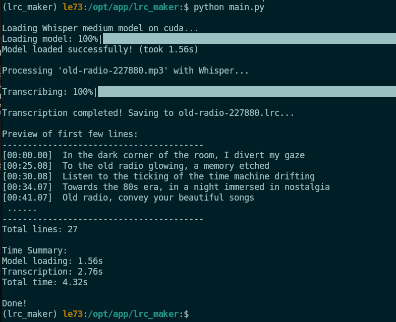
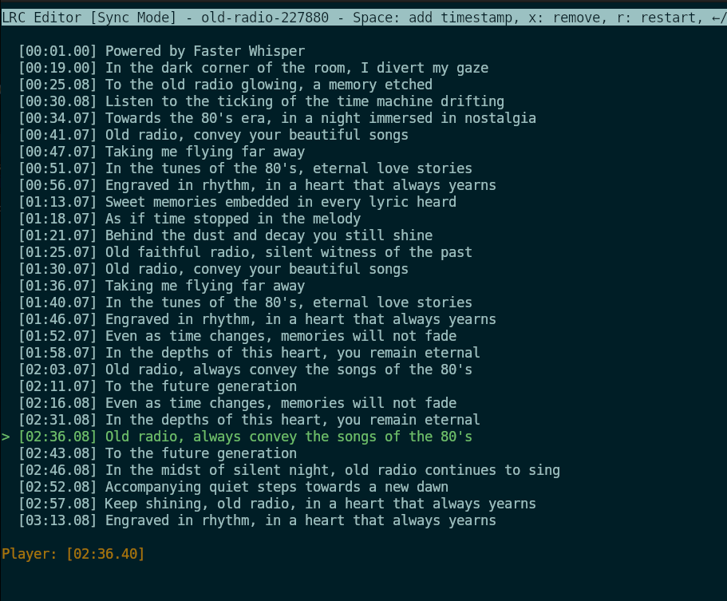

# Audio Transcription Tool LRC_MAKER

A Python-based tool that converts speech from MP3 files into timestamped 
text using OpenAI's Whisper model (via Faster-Whisper). The output is 
saved in LRC format, making it perfect for subtitles or synchronized lyrics.

## Features

- 🎯 Interactive file selection with fuzzy finder
- 🚀 GPU-accelerated transcription
- ⏱️ Real-time progress tracking
- 🎯 Timestamped output in LRC format
- 📊 Performance metrics and timing information
- 🛑 Graceful interrupt handling

## Prerequisites

- Python 3.8+
- CUDA-capable GPU (recommended)
- FFmpeg (for audio processing)
- Test on Ubuntu 22.04 CUDA 12.5

## Installation

1. Clone the repository: 
   
# Lyrics Tool  LRC_EDITOR 

LRC (Lyric) Editor integrated with MPRIS (Media Player Remote Interfacing Specification). 
It allows users to create or edit synchronized lyrics files (.lrc) while listening to audio 
tracks in a media player that supports the MPRIS interface, such as VLC, Rhythmbox, or Audacious. 
The script uses a curses-based text interface to provide a simple terminal-based UI for managing lyrics.

## Keyboard Controls

* up/down: Navigate through lyric lines
* <SPC>: Synchronize the current line with the playback timestamp
* e: Toggle between edit mode and sync mode
* s: Save changes to the .lrc file
* q: Quit the editor

